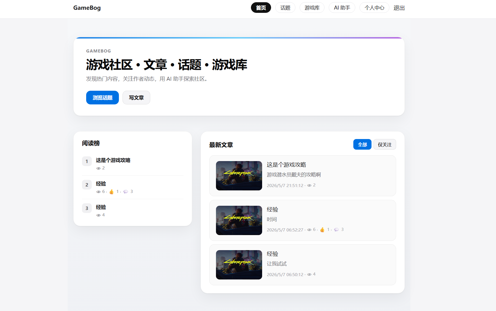
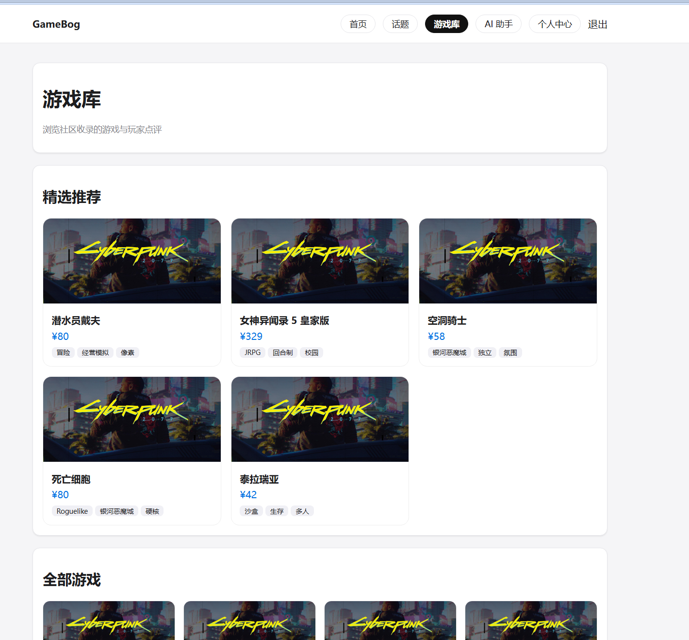
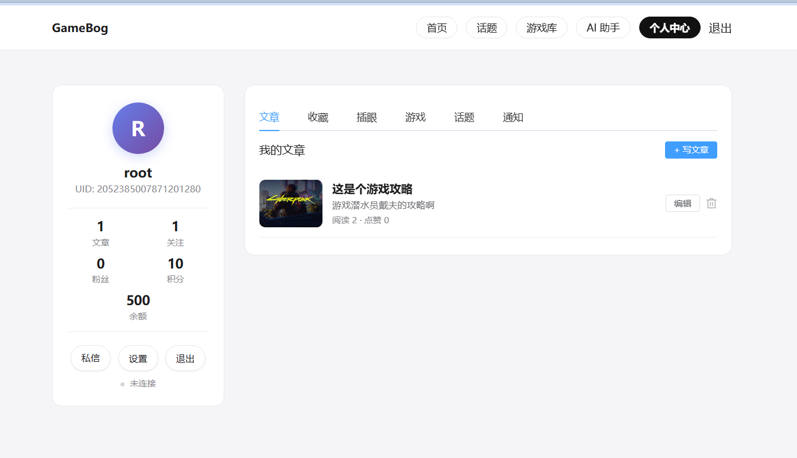
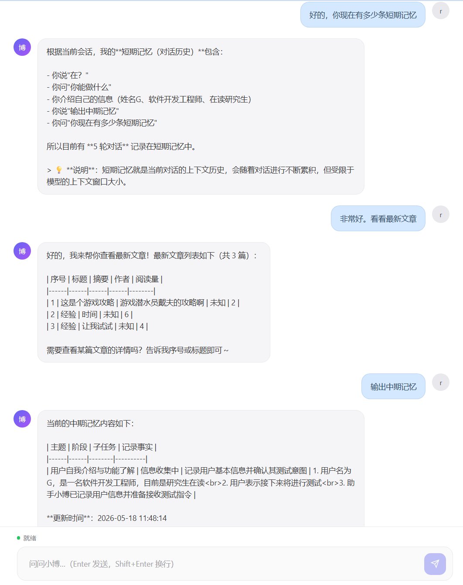

# GoBlog

基于 **Gin + GORM + Redis + NSQ + Kafka + Elasticsearch** 的社区论坛，含 Vue 前端与 Python AI 助手。

## 界面预览

|             首页             |                文章详情                |
| :--------------------------: | :------------------------------------: |
|  |  |

|              游戏库              |               个人中心               |
| :------------------------------: | :----------------------------------: |
|  |  |



## 功能概览

- 用户注册登录、JWT 鉴权、关注与粉丝
- 文章发布/编辑/搜索，点赞与阅读异步统计（NSQ + Redis + MySQL）
- 评论、私信、话题与游戏库
- 通知：Kafka 异步 + WebSocket 实时推送，离线补偿
- 全文检索（Elasticsearch），热门与排行榜（Redis ZSet）
- AI 个人助手（`agent/`，对接博客 MCP 与 RAG）

## 技术栈

| 层        | 技术                      |
| --------- | ------------------------- |
| 后端      | Go、Gin、GORM、MySQL      |
| 缓存/队列 | Redis、NSQ、Kafka         |
| 搜索      | Elasticsearch             |
| 前端      | Vue 3、Vite、Element Plus |
| 部署      | Docker Compose、Nginx     |

## 目录结构

`bootstrap` · `router` · `handler` · `service` · `database` · `mq` · `middleware` · `setting` · `webapp` · `agent`

## 服务与端口

| 服务                | 地址                  |
| ------------------- | --------------------- |
| 后端 API            | http://127.0.0.1:8084 |
| 前端（Vite 热更新） | http://127.0.0.1:5173 |
| NSQ Admin           | http://127.0.0.1:4171 |
| Qdrant              | http://127.0.0.1:6333 |
| MongoDB             | 127.0.0.1:27017       |
| Redis               | 127.0.0.1:6379        |
| MySQL               | 127.0.0.1:3306        |
| Kafka               | 127.0.0.1:9092        |

## 快速启动

**启动依赖服务：**

```bash
docker compose up -d
```

**本机启动 Go 后端：**

```bash
go run .
```

**全栈开发（Go + Vue 热更新，无需本机 Node）：**

```bash
docker compose --profile dev up -d
docker compose --profile dev up -d --force-recreate dev
```

- 前端：http://127.0.0.1:5173  
- 后端：http://127.0.0.1:8084  

新增/修改 Go 接口后需重建 dev 容器：`docker compose --profile dev up -d --force-recreate dev`

**生产/容器一键：**

```bash
docker compose --profile app up -d --build
```

健康检查：`GET /healthz`、`GET /readyz`

**AI 助手：** 见 [agent/README.md](agent/README.md)

## 配置

主配置：`setting/common.yaml`。敏感信息通过环境变量注入，不应直接写在配置文件中。

| 环境变量              | 说明                      | 对应配置项            |
| --------------------- | ------------------------- | --------------------- |
| `AUTH_JWT_SECRET`     | JWT 签名密钥（**必填**）  | `auth.jwt_secret`     |
| `MYSQL_PASSWORD`      | MySQL 密码                | `mysql.password`      |
| `REDIS_PASSWORD`      | Redis 密码                | `redis.password`      |
| `SEARCH_API_KEY`      | Elasticsearch API Key     | `search.api_key`      |

常用项：`mq.nsq.enabled`、`mq.kafka`、搜索与 Agent 相关配置见 `agent/config/config.yaml`。

### 飞书机器人（可选）

统一 IM 收发层：`handler/channel`（Hub + Adapter）。飞书回调：

- `POST /api/v1/channel/feishu/webhook`（推荐）
- `POST /api/v1/channel/feishu/event`（兼容旧路径）

无需 JWT。环境变量：

| 变量                                  | 说明                                      |
| ------------------------------------- | ----------------------------------------- |
| `FEISHU_APP_ID` / `FEISHU_APP_SECRET` | 自建应用凭证                              |
| `FEISHU_VERIFICATION_TOKEN`           | 事件订阅「Verification Token」            |
| `FEISHU_ENCRYPT_KEY`                  | 启用加密时填写；与平台「Encrypt Key」一致 |

开放平台配置：订阅 `im.message.receive_v1`，请求 URL 填 `https://<公网域名>/api/v1/channel/feishu/event`。需同时启动 Python Agent（`AGENT_URL`）。单聊直接发文字；群聊需 @ 机器人。飞书用户映射为合成 `user_id`（Redis），会话按 `chat_id` 与 Web 侧边栏隔离。

搜索服务默认关闭，如需启用 Elasticsearch，请参考 [docker-compose.yml](docker-compose.yml) 中注释的 elasticsearch 服务。

API 前缀 `/api/v1`，鉴权头 `Authorization: Bearer <token>`。

## AI 智能助手

项目包含一个完整的 Python AI 助手（`agent/`），基于大语言模型 + 三层记忆系统 + MCP 工具集，为博客用户提供自然语言交互体验。

核心特性：
- **三阶段编排**：Query 改写 → 路由选组 → Agent 执行（SSE 流式推送）
- **三层渐进记忆**：Redis 短期缓存 → LLM 中期摘要 → MongoDB + Qdrant 长期记忆
- **MCP 工具集**：按 public/user/general 分组，路由阶段轻量选组，执行阶段动态注入
- **Hybrid RAG**：稀疏检索 + 语义向量检索 + RRF 重排，结合时间衰减提升精度
- **可观测性**：全链路 request_id、结构化事实帧、Prometheus 指标

> 详细文档、启动方式、API 参考、配置说明见 **[agent/README.md](agent/README.md)**

## 测试

```bash
go test ./...
go vet ./...
```

数据迁移见 `database/migrations/README.md`。
